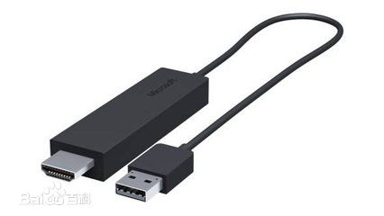
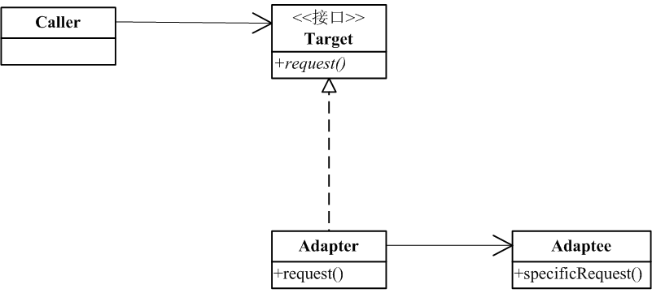
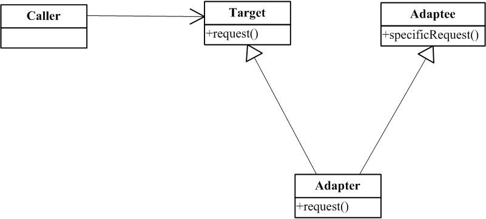

# 适配器模式

### 是什么？

将一个类的接口转换成客户希望的另外一个接口。Adapter使原本由于接口不兼容的类能够一个工作。

### 结构组成及作用

其实可以从适配器的描述来解释适配器模式的作用。百度百科对适配器的定义是：适配器是一个接口转换器。还有百度百科里给出了一张足以形象的解释适配器（模式）的图。


从上图可以看出，其实适配器模式就是让一个对象去弥合两个接口，我们可以将这个现有的类与我们的目标进行适配，最终获得一个符合需要的接口并且包含待复用的类的功能的类。

所以，要明确一点，适配器模式是补救措施，在系统设计阶段一般不会使用该模式。

适配器模式一般有两种：对象适配器和类适配器模式。

下图是对适配器模式定义的uml：

对象适配器

类适配器



### 示例实现

java（包括java8）不支持类适配器模式的实现，so，以下是对象适配器模式的实现

《深入浅出设计模式》中提到了一个挺实际的例子，我这里就直接模拟它啦。。

假设我们是客户端，服务端有一段旧代码是这样：
~~~
public <T> Enumeration<T> getEnumeration(T type) {
    Vector<T> vector = new Vector<>();
    //some operation
    return vector.elements();
}
~~~

然后,我们会为了使用它返回的Enumeration，但是，我们得代码都是使用新式的Iterator，那么，就要求我们把返回的Enumeration通过适配器成Iterator。

~~~
/**
 * @author  Lee Boynton
 * @since   JDK1.0
 */
public interface Enumeration<E> {
    boolean hasMoreElements();
    E nextElement();
}
~~~
~~~
//偶遇Josh Bloch一只。。
/**
 * @author  Josh Bloch
 * @see Collection
 * @see ListIterator
 * @see Iterable
 * @since 1.2
 */
public interface Iterator<E> {
    boolean hasNext();

    E next();

    default void remove() {
        throw new UnsupportedOperationException("remove");
    }

    default void forEachRemaining(Consumer<? super E> action) {
        Objects.requireNonNull(action);
        while (hasNext())
            action.accept(next());
    }
}

~~~
适配器如下：
[include:6-](../src/main/java/com/tea/adapter/EnumerationIterator.java)


[完整代码么么哒](https://github.com/teaho2015/design-patterns-learning/tree/master/src/main/java/com/tea/adapter/)。


### 效果及应用场景

在下面的情况下可以考虑使用适配器模式：

 处理旧系统代码时，希望能重用代码或希望能弥合旧系统与新系统的接口。

### 后记

#### 关于java支不支持类适配器的问题。

我一开始写这篇适配器模式时想的是不支持。也因为维基百科中说Java8支持适配器模式，所以这个问题一直萦绕在心。今天想认真再想下。

首先，谨记[定义](#是什么？)所描述的，那么类适配器的实现不过是通过多继承来实现一种单向或双向的适配器。

Java8由于接口的默认方法新特性，而具备了一种“类似”多继承的表征。但是，这个表征毕竟不等于多继承。

因为类适配器必须通过比如<code>extend AClass, BClass</code>来获得两个目标的实现，
所以类似于如下实现是可以的，<code>interface C</code>相当于Adapter。
````
interface A1 {
    default void say(int a) {
        System.out.println("A1");
    }
}

interface A2 extends A1 {

}

interface B {
    default void say(int a) {
        System.out.println("B");
    }
}
interface C extends A2,B{
    default void say(int a) {
        B.super.say(a);
    }
}
````

但是毕竟java8不提供多继承（即不能extend 两个类），所以结论是类适配器模式在java里是非常局限的。

对了，在找资料的过程，找到两个非常有干货的文章，他们都是描述了当实现了多个接口和继承了类中存在同名方法时，java的选择机制。
* [Java 8 默认方法和多继承](http://www.importnew.com/16013.html)
* [Java language specification | 15.12.2.5. Choosing the Most Specific Method](http://docs.oracle.com/javase/specs/jls/se8/html/jls-15.html#jls-15.12.2.5)


### references
[1] [百度百科|适配器](http://baike.baidu.com/link?url=aFvL_b7QTew2q_ARkIRK4Osge9kH0j7yzZ9GpBU1kgMX73wrJUL_S23LAXpRRJJz1G7t_UZQz0ZjHE9dQW7Ufi70ApLSyncVU2k-aiFI44vSrIVV7rz6Caj6jGGoV8QZ)
