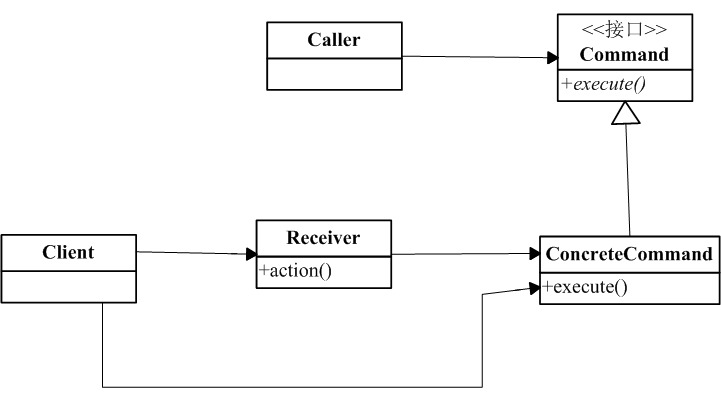

# 命令模式

### 是什么？

先举个生活中的例子阐述命令模式。平时我们去银行办业务，快餐厅吃饭，有时因为人数多，资源有限等原因，我们必须排号，这个就是一个命令模式。
在这个例子里，由于我们的命令（办业务命令、点餐命令）不能马上执行，排号机接受了我们的命令，通过队列等，让我们的命令能保存（封装）下来，以便执行。

定义：一般“行为请求者”与“行为实现者”通常会紧密相连，有时我们需要把他们分离开实现一些功能，而命令模式则将“请求”封装成对象，实现了松耦合。

### 结构组成及作用

下图是对命令模式定义的uml：

画出类图一目了然，图中command将receiver的action封装起来，以供执行。

### 示例实现

示例代码模拟电灯开关。
[include:8-](../src/main/java/com/tea/command/Command.java)
实际执行类
[include:7-](../src/main/java/com/tea/command/Light.java)
[include:7-](../src/main/java/com/tea/command/Switch.java)
[include:7-](../src/main/java/com/tea/command/TurnOnCommand.java)
[include:7-](../src/main/java/com/tea/command/TurnOffCommand.java)
[include:7-](../src/main/java/com/tea/command/TestMain.java)

####java8实现
[include:7-](../src/main/java/com/tea/command/Command.java)
[include:7-](../src/main/java/com/tea/command/Light.java)
[include:7-](../src/main/java/com/tea/command/Switch.java)
[include:7-](../src/main/java/com/tea/command/Java8TestMain.java)

[完整代码么么哒](https://github.com/teaho2015/design-patterns-learning/tree/master/src/main/java/com/tea/command/)。

### 效果及应用场景

在下面的情况下可以考虑使用命令模式：

1. 在不同时刻拍队列、执行请求。也就是说，当使用者希望封装起来的command对象可以与原始“请求”有一个无关的生存期时。
2. 希望支持日志和系统恢复。
3. 希望支持取消撤销操作。

### references
