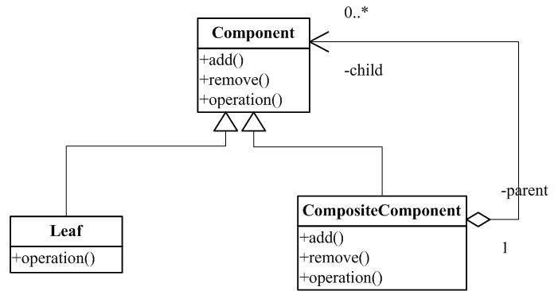
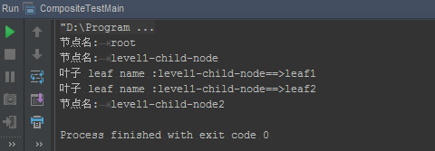

# 组合模式

### 是什么？

组合模式将对象组合成树型结构以表示“部分-整体”的层次结构。组合使用户能以一致的方式访问单个对象和组合对象。

### 结构组成及作用

下图是组合模式的UML类图：

组合模式是用来表示“部分-整体”的层次结构。

举个例子，我们常用的文件系统就是这样一个树型结构。文件夹和文件就是两个不同的对象，他们在很多操作上（复制、删除等）都是用同样的方式进行的。这就是定义所说的一致性。

那么组合模式的作用是什么呢？

* 表示“部分-整体”的树型结构。
* 让用户忽略组合对象和个体的差别，提供一种一致性的访问方式，也简化了代码。

### 示例实现

由定义可知，组合模式是对象组合以部分-整体表示，而且以一种一致性的方式访问，那么要实现这种一致性，个体与组合两者必须有类似的实现（也就是说实现共同的接口或类）。

实现如下（<code>foreach()</code>相当于UML类图中的<code>operation()</code>）：

[include:5-](../src/main/java/com/tea/composite/CompositeTestMain.java)

输出：

[完整代码么么哒]: (https://github.com/teaho2015/design-patterns-learning/tree/master/src/main/java/com/tea/iterator/)。

### 效果及应用场景

表示一种“部分-整体”的树型结构。

### references
（无）。
