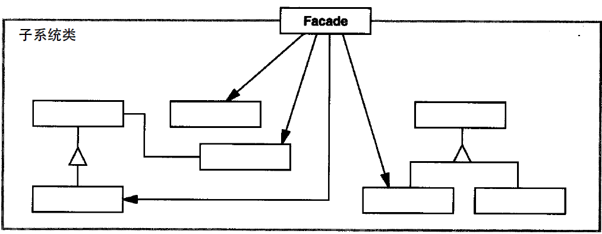

# 外观模式

### 是什么？

外观模式提供一个统一的高层的接口，用来访问子系统中的一群接口。

### 结构组成及作用

外观模式是比较容易理解的一个设计模式。举个最易懂常见的例子，一般web后端开发人员都接触过MVC模式，而在MVC中，我们会将M层中分为Controller,Service,DAO，pojo等常见分层。
而Service层就应用了外观模式，把巨多细节（n个DAO操作等等）按照一定的逻辑进行抽象封装在一起。简单来说，一般可能一个业务操作（service里的一个方法）里包含对多个dao的操作，这单个service方法相当于下图中的Facade(外观)。

### 示例实现

这模式我决定不贴代码罗。

[完整代码么么哒](https://github.com/teaho2015/design-patterns-learning/tree/master/src/main/java/com/tea/facade/)。

### 效果及应用场景

外观模式使特定的逻辑得到封装，减少客户与子系统间的耦合，方便调用。

### 注意点

《深入浅出设计模式》里提到一个原则：“最少知识”原则。里面提到为尽量减少耦合，Facade里的调用应该遵循以下条款：
只应该调用
1. 该对象本身
2. 被当作方法的参数而传递进来的对象
3. 此方法所处创建或实例化的任何对象
4. 对象的任何组件

### references
(无)。