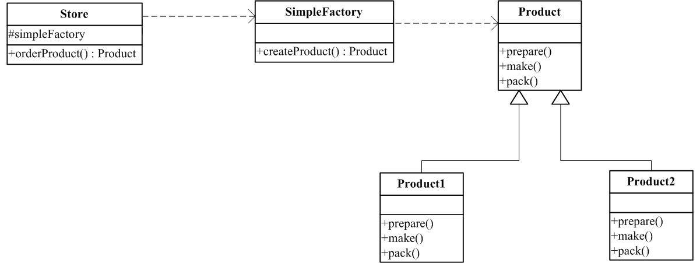

# 工厂模式

事实上没有工厂模式这一说，由于我希望能说下简单工厂，而且我的学习是按《深入浅出设计模式》的顺序来进行的，所以就顺便把抽象工厂和工厂方法也放一起说吧。

### 作用
其实这个也是我把工厂方法和抽象工厂模式这两者放在一起的原因，在我看来，这三者（包括简单工厂）的作用是一致的，就是：把对象创建的过程从具体类中抽离，并封装起来，从而实现解耦和重用。

### 待优化示例
在这里列出一个例子，在后文各模式介绍部分将通过这个示例进行分别阐述。[完整代码](https://github.com/teaho2015/design-patterns-learning/tree/master/src/main/java/com/tea/factory/origin)
示例主要模拟商店提供商品的过程。
[include:7-](../src/main/java/com/tea/factory/origin/Store.java)

[include:7-](../src/main/java/com/tea/factory/origin/TestMain.java)
可以看出，以下部分是会因为需求变化，需要提供不同product而经常性修改的且很可能在其他Store类中重复出现。
~~~
 switch (type) {
   case "1":
         product = new Product1();
        break;
     case "2":
         product = new Product2();
         break;
     default:
        break;
 }
~~~
而以下这部分，却是一般不会变动的代码。
~~~
product.prepare();
product.make();
product.pack();
~~~
所以，封装上上面的创建对象的代码就是工厂模式的使命。

## 简单工厂
### 是什么？

简单工厂只是一种较为常用的编程用法吧，并不是一个设计模式。

### 结构组成

下图是简单工厂的UML类图：

### 示例实现

这是[完整代码](https://github.com/teaho2015/design-patterns-learning/tree/master/src/main/java/com/tea/factory/simple)。

主要是把创建Product对象的过程封装到<code>SimpleFactory.java</code>中。

[include:7-](../src/main/java/com/tea/factory/simple/SimpleFactory.java)

额，对了，上面的<code>createProduct(String type)</code>方法可以改为静态(称为静态工厂)。当然，改为静态就不能通过继承来改变创建方法的行为。

### 效果及应用场景

## 工厂方法模式

## 抽象工厂模式

### References
[1][ wiki百科|File:Decorator UML class diagram.svg ](https://en.wikipedia.org/wiki/File:Decorator_UML_class_diagram.svg)
