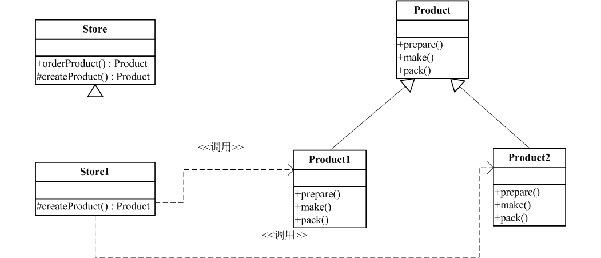

# 工厂模式

事实上没有工厂模式这一说，由于我希望能说下简单工厂，而且我的学习是按《深入浅出设计模式》的顺序来进行的，所以就顺便把抽象工厂和工厂方法也放一起说吧。

### 作用
其实这个也是我把工厂方法和抽象工厂模式这两者放在一起的原因，在我看来，这三者（包括简单工厂）的作用是一致的，就是：把对象创建的过程从具体类中抽离，并封装起来，从而实现解耦和重用。

### 待优化示例
在这里列出一个例子，在后文各模式介绍部分将通过这个示例进行分别阐述。[完整代码](https://github.com/teaho2015/design-patterns-learning/tree/master/src/main/java/com/tea/factory/origin)
示例主要模拟商店提供商品的过程。
[include:7-](../src/main/java/com/tea/factory/origin/Store.java)

[include:7-](../src/main/java/com/tea/factory/origin/TestMain.java)
可以看出，以下部分是会因为需求变化，需要提供不同product而经常性修改的且很可能在其他Store类中重复出现。
~~~
 switch (type) {
   case "1":
         product = new Product1();
        break;
     case "2":
         product = new Product2();
         break;
     default:
        break;
 }
~~~
而以下这部分，却是一般公有的不会变动的代码。
~~~
product.prepare();
product.make();
product.pack();
~~~
所以，封装上上面的创建对象的代码就是工厂模式的使命。

## 简单工厂
### 是什么？

简单工厂只是一种较为常用的编程用法吧，并不是一个设计模式。

### 结构组成

下图是简单工厂的UML类图：

### 示例实现

这是[完整代码](https://github.com/teaho2015/design-patterns-learning/tree/master/src/main/java/com/tea/factory/simple)。

主要是把创建Product对象的过程封装到<code>SimpleFactory.java</code>中。

[include:7-](../src/main/java/com/tea/factory/simple/SimpleFactory.java)

额，对了，上面的<code>createProduct(String type)</code>方法可以改为静态(称为静态工厂)。当然，改为静态就不能通过继承来改变创建方法的行为。

## 工厂方法模式

### 是什么？

工厂方法模式定义了一个创建对象的工厂接口，由子类负责实现这个方法，把实例化推迟到子类中。

### 结构组成

下图是工厂方法模式的UML类图：

### 示例实现

核心实现，在Store中增加一个工厂方法<code>createProduct(String type)</code>如下：

[include:7-](../src/main/java/com/tea/factory/factoryMethod/Store.java)

[完整代码看这里](https://github.com/teaho2015/design-patterns-learning/tree/master/src/main/java/com/tea/factory/factoryMethod)。

## 抽象工厂模式

### 是什么？

抽象工厂模式提供一个接口，用于创建相关或依赖的类的家族，而且无需指定他们的具体类。

### 结构组成

下图是摘自Wikipedia中抽象工厂模式的UML类图（对比了下，比我画的美观多了。。，就直接用维基的吧）：

### 示例实现

[完整代码看这里](https://github.com/teaho2015/design-patterns-learning/tree/master/src/main/java/com/tea/factory/abstractFactory)。

连接的代码简单地按照了上图的[结构组成](#结构组成)中的UML实现出来的，在这里不再重复贴代码。对了，《深入浅出设计模式》中抽象工厂模式部分用一个结合了抽象工厂模式和工厂方法模式的实例去解读抽象工厂，比较形象，可以去读一下，也能从中品味两种工厂模式的区别和他们结合的威力。

## References
[1][wikipedia | 抽象工厂模式](https://en.wikipedia.org/wiki/Abstract_factory_pattern)

