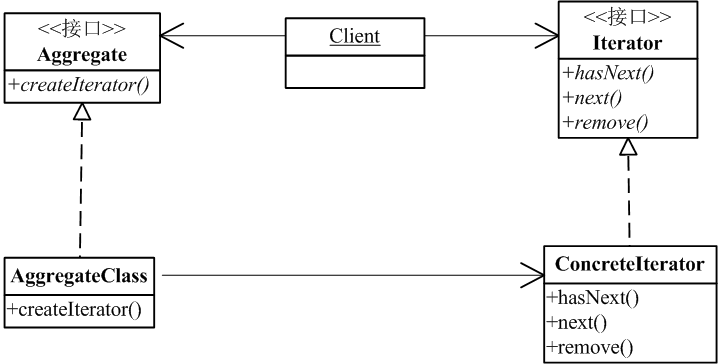

# 迭代器模式

### 是什么？

迭代器模式提供一种方法访问一个聚合对象中的各个元素，而又不暴露其内部的表示。

### 结构组成及作用

下图是模板方法模式的UML类图：

#### 作用

举个例子，我们平常用的集合的<code>iterator()</code>返回的iterator就是“迭代器”。事实上，<code>java.util.Collection<T>.iterator()</code>就是应用了迭代器模式。

为什么要使用迭代器模式？或者说，jdk的集合类为什么要实现迭代器模式呢？

我记得我刚开始学集合的时候，对于为何使用Iterator是有点疑惑。现在的话，我觉得迭代器起码能有这几点好处：
1. 重要的一点是，它提供了一种遍历聚合的方式，但并不会暴露内部实现。譬如，我们能通过<code>ArrayList的iterator()</code>获得Iterator对象（而不是内部实现的数组），但是我们不看源码是不会知道ArrayList是使用数组实现的。
2. 我们能通过共同的接口方法<code>next()</code>等实现集合的遍历操作，而不是每个不同的集合都构建一套操作，对于调用集合的Client来说，遍历代码能够重用共用。

### 示例实现

迭代器模式的实现在jdk中随处可见，可参考implement了<code>java.util.Collection<T></code>接口的集合类。

[完整代码么么哒]: (https://github.com/teaho2015/design-patterns-learning/tree/master/src/main/java/com/tea/iterator/)。

### 效果及应用场景

迭代器模式可用来：
* 访问一个聚合对象的内容而无需暴露它的内部表示。
* 支持对聚合对象的多种遍历。
* 为遍历不同的聚合结构提供一个统一的接口(即, 支持多态迭代)。

### 后记

这里补充相关的foreach的实现原理。
~~~
foreach即形如以下代码的形式:
List<String> list = new ArrayList<>();
list.add...
...
for(String s : list) {
    ...
}
~~~
众所周知，foreach能遍历集合类，先看下例子：
[include:12-](../src/main/java/com/tea/iterator/TestIteratorCompileMain.java)

那么应该有人疑惑为什么foreach能循环遍历集合？
我将上面的java类例子的.class文件利用工具反编译得出如下代码（其实也可用javap -verbose来查看）:
[include:12-](decompileFile.txt)

对比上述两代码块，可得出结论：foreach是一个java语法糖。

那么foreach的适用范围是什么？

这是《java语言规范》对foreach的定义([Java Language Specification | 14.14.2. The enhanced for statement ](http://docs.oracle.com/javase/specs/jls/se8/html/jls-14.html#jls-14.14.2))，里面有一句话：
>The type of the Expression must be Iterable or an array type (§10.1), or a compile-time error occurs.

也就是说foreach仅适用于实现了Iterator接口的类或数组类型。

### references

[1]Erich Gamma,Richard Helm,Ralph Johnson,John Vlissides.设计模式:可复用面向对象软件的基础[M].中国:机械工业出版社，2000
