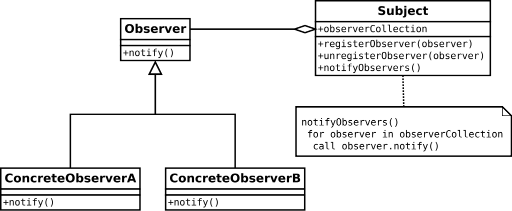

# 观察者模式

### 是什么？

观察者模式定义了一个对象一对多的依赖。这样一来，当该对象的状态发生变化时，它的依赖对象会收到通知并且作出操作（更新）。

### 结构组成及作用

下图是wiki百科中对观察者模式定义的UML：

这种关系也可称为，发布-订阅(publish-subscribe)。

为什么要使用观察者模式？有些时候，我们需要维护对象间的一致性，而且我们希望他们之间不会有太紧密的关联而是维持一种松耦合。
举个例子：当存在一个比如是校园新闻通知公告主体，当我（们）需要它发出的通知，我会仅希望这个公告主体仅通过我给它的地址来发送一个更新给我（们），
而不是，我（们）要通过继承或其他方式去持有或获取这个公告主体的新闻状态，更不用它关心我（们）谁是谁有多少个。

### 实现

观察者模式是少数的jdk提供实现的设计模式之一，一定程度上体现了它的重要性。

#### 我的实现

其实按照[结构组成及作用](#结构组成及作用)中UML图所描述，可以轻易地写出观察者模式的两个核心：
[include:3-](../src/main/java/com/tea/observer/customImpl/Subject.java)
[include:3-](../src/main/java/com/tea/observer/customImpl/Observer.java)

具体实例代码为了节省篇幅，就不在这里放出来了。示例代码在这里（我以房子买卖公告板为例，下同）：[我的观察者模式实现](https://github.com/teaho2015/design-patterns-learning/tree/master/src/main/java/com/tea/observer/customImpl/)。

#### jdk内置实现

java提供的实现核心是Observable类[java.util.Observable](http://docs.oracle.com/javase/8/docs/api/java/util/Observable.html)和Observer接口[java.util.Observer](http://docs.oracle.com/javase/8/docs/api/java/util/Observer.html)。

[我使用jdk内置的类和观察者接口的例子代码](https://github.com/teaho2015/design-patterns-learning/tree/master/src/main/java/com/tea/observer/jdkImpl/)。

##### jdk内置实现的缺点
[java.util.Observable](http://docs.oracle.com/javase/8/docs/api/java/util/Observable.html)是一个类，这并不是一件好事。

也就是说，我们必须设计一个类去继承它。因为它不是接口（它拥有自带的私有属性，各种方法），我们没法（或者说有代价）建立自己一套实现，而且这限制了Observable的复用潜力，因为我们的实现不能同时继承Observable类和其他潜在abstract类的行为。

选择哪种实现没有定式，有时或许java.util.Observable已经能满足我们需求了。

### 效果及应用场景
在以下情况下可以使用观察者模式[ [2] ](#references):
* 当一个抽象模型有两个方面, 其中一个方面依赖于另一方面。将这二者封装在独立的对象中以使它们可以各自独立地改变和复用。
* 当对一个对象的改变需要同时改变其它对象, 而不知道具体有多少对象有待改变。
* 当一个对象必须通知其它对象，而它又不能假定其它对象是谁。换言之, 你不希望这些对象是紧密耦合的。

### References
[1][ wiki百科|File:Observer.svg ](https://en.wikipedia.org/wiki/File:Observer.svg)

[2]Erich Gamma,Richard Helm,Ralph Johnson,John Vlissides.设计模式:可复用面向对象软件的基础[M].中国:机械工业出版社，2000