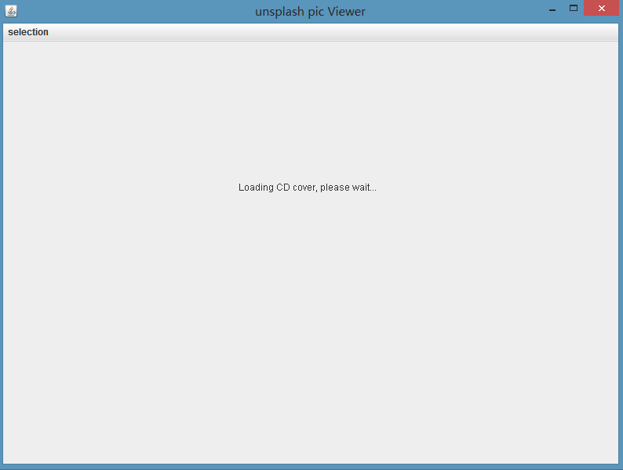
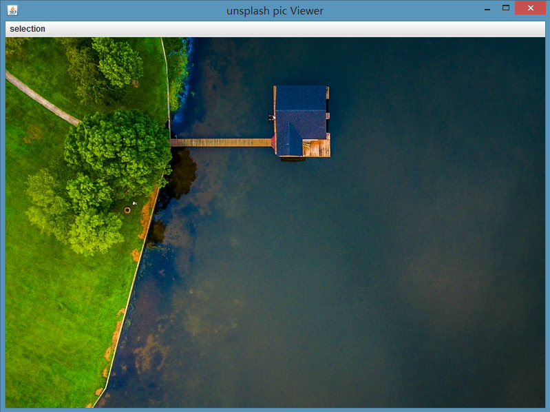

# 代理模式

### 是什么？

代理模式为某对象创建一个代理对象，让代理对象控制该对象的访问。被代理对象可以使远程的对象、创建开销大的对象或需要安全控制的对象。

### 结构组成及作用

下图是代理模式的UML类图：

#### 作用

《head first Design Patterns》和 Gang of Four的《设计模式》[ [1] ](#references)两本书中，都描述了三种代理形式：远程代理、虚拟代理、保护代理。
从这三种代理可窥探出代理模式的作用：
1. 提供一种不同空间的局部代理。
2. 根据需要创建开销大的对象。
3. 控制对ConcreteSubject对象（如图，即被代理对象）的访问。

其实这三种形式的类图结构都有所不同，事实上，是存在很多代理模式的变体的，但是，其实我们要记得的是他们行为的共通点是：
** 将客户(Caller)对ConcreteSubject对象（如图，即被代理对象）的直接访问拦截下来，变为间接。那么这个行为将提供给我们在其中很大的操作空间。 **

### 示例实现

下面我将提供 远程代理、虚拟代理、保护代理三种形式的实现。

#### 虚拟代理

觉得《head first设计模式》的例子挺好，本来想试着用javaFx模拟实现一下，后来做了下发现javaFx的Image加载图片时是不会假死，所以就照这书里的swing实现做了一次。

代码不贴了，贴两个效果图，可以看到通过代理模式，图片实现延迟及异步加载了。

[完整代码么么哒](https://github.com/teaho2015/design-patterns-learning/tree/master/src/main/java/com/tea/proxy/virtualproxy/)。

#### 保护代理

保护代理有两种：一种是按照上面类图实现的静态代理，一种是我们喜闻乐见的Java提供Proxy API的作为Spring AOP原理的动态代理。

下面模拟一般业务后端给DAO或Service的代理。

##### 公用类
User类及其Builder
[include:7-](../src/main/java/com/tea/proxy/protectProxy/User.java)
[include:7-](../src/main/java/com/tea/proxy/protectProxy/UserBuilder.java)
DAO实现类
[include:7-](../src/main/java/com/tea/proxy/protectProxy/UserDAOImpl.java)

##### 静态代理

[include:7-](../src/main/java/com/tea/proxy/protectProxy/staticProxy/ProtectProxy.java)
[include:7-](../src/main/java/com/tea/proxy/protectProxy/staticProxy/TestMain.java)

##### 动态代理

[include:7-](../src/main/java/com/tea/proxy/protectProxy/dynamicProxy/ProtectedProxy.java)
[include:7-](../src/main/java/com/tea/proxy/protectProxy/dynamicProxy/TestMain.java)

[完整代码么么哒](https://github.com/teaho2015/design-patterns-learning/tree/master/src/main/java/com/tea/proxy/protectProxy/)。

#### 远程代理

把远程代理放到这几个代理之后是因为远程代理还有我没能解决的rmi的报错问题。放在这里希望有熟悉rmi的有缘人帮下忙。

我在[github的remoteProxy](https://github.com/teaho2015/design-patterns-learning/tree/master/src/main/java/com/tea/proxy/remoteproxy/)目录里分别放了三个demo:
1. [深入浅出设计模式里的demo](https://github.com/teaho2015/design-patterns-learning/tree/master/src/main/java/com/tea/proxy/remoteproxy/gumball/)
2. [一个小demo](https://github.com/teaho2015/design-patterns-learning/tree/master/src/main/java/com/tea/proxy/remoteproxy/demo/)
3. [oracle java文档 rmi getting Started的helloworld demo](https://github.com/teaho2015/design-patterns-learning/tree/master/src/main/java/com/tea/proxy/remoteproxy/helloworld/), [oracle doc|Getting Started Using Java RMI](https://docs.oracle.com/javase/8/docs/technotes/guides/rmi/hello/hello-world.html)。

翻了不少资料，也debug了好几个最后几个demo基本都卡在了这个exception（[stackoverflow 问题 | java.rmi.ConnectException: Connection refused to host: 127.0.1.1; ](http://stackoverflow.com/questions/15685686/java-rmi-connectexception-connection-refused-to-host-127-0-1-1)）上，但是问题下的解答并不能解决我的问题。我在网上也发了问题，望有人能解答。

[完整代码么么哒](https://github.com/teaho2015/design-patterns-learning/tree/master/src/main/java/com/tea/proxy/remoteproxy/)。

### 效果及应用场景

见[作用](#作用)中的说明。

### references
[1] Erich Gamma,Richard Helm,Ralph Johnson,John Vlissides.设计模式:可复用面向对象软件的基础[M].中国:机械工业出版社，2000
