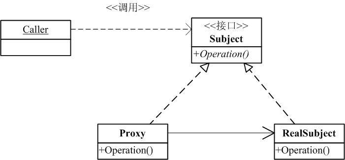

# 代理模式

### 是什么？

代理模式为某对象创建一个代理对象，让代理对象控制该对象的访问。被代理对象可以使远程的对象、创建开销大的对象或需要安全控制的对象。

### 结构组成及作用

下图是代理模式的UML类图：

#### 作用

《head first Design Patterns》和 Gang of Four的《设计模式》[ [1] ](#references)两本书中，都描述了三种代理形式：远程代理、虚拟代理、保护代理。
从这三种代理可窥探出代理模式的作用：
1. 提供一种不同空间的局部代理。
2. 根据需要创建开销大的对象。
3. 控制对ConcreteSubject对象（如图，即被代理对象）的访问。

其实这三种形式的类图结构都有所不同，事实上，是存在很多代理模式的变体的，但是，其实我们要记得的是他们行为的共通点是：
** 将客户(Caller)对ConcreteSubject对象（如图，即被代理对象）的直接访问拦截下来，变为间接。那么这个行为将提供给我们在其中很大的操作空间。 **

### 示例实现

下面我将提供 远程代理、虚拟代理、保护代理三种形式的实现。

#### 远程代理

[完整代码么么哒](https://github.com/teaho2015/design-patterns-learning/tree/master/src/main/java/com/tea/proxy/remoteproxy/)。

#### 虚拟代理

[完整代码么么哒](https://github.com/teaho2015/design-patterns-learning/tree/master/src/main/java/com/tea/proxy/virtualproxy/)。

#### 保护代理

保护代理有两种：一种是按照上面类图实现的静态代理，一种是我们喜闻乐见的Java提供Proxy API的作为Spring AOP原理的动态代理。

下面模拟一般业务后端给DAO或Service的代理。

##### 公用类
User类及其Builder
[include:7-](../src/main/java/com/tea/proxy/protectProxy/User.java)
[include:7-](../src/main/java/com/tea/proxy/protectProxy/UserBuilder.java)
DAO实现类
[include:7-](../src/main/java/com/tea/proxy/protectProxy/UserDAOImpl.java)

##### 静态代理

[include:7-](../src/main/java/com/tea/proxy/protectProxy/staticProxy/ProtectProxy.java)
[include:7-](../src/main/java/com/tea/proxy/protectProxy/staticProxy/TestMain.java)

##### 动态代理

[include:7-](../src/main/java/com/tea/proxy/protectProxy/staticProxy/ProtectedProxy.java)
[include:7-](../src/main/java/com/tea/proxy/protectProxy/staticProxy/TestMain.java)

[完整代码么么哒](https://github.com/teaho2015/design-patterns-learning/tree/master/src/main/java/com/tea/proxy/protectProxy/)。

### 效果及应用场景

见[作用](#作用)中的说明。

### references
[1] Erich Gamma,Richard Helm,Ralph Johnson,John Vlissides.设计模式:可复用面向对象软件的基础[M].中国:机械工业出版社，2000
