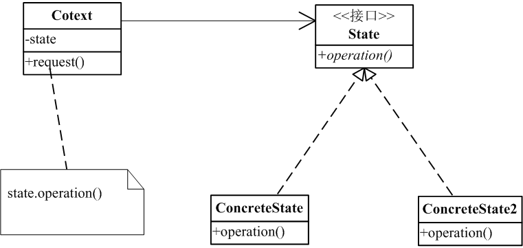
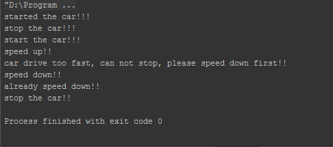

# 状态模式

### 是什么？

状态模式允许对象在内部状态改变是改变它的行为，对象看起来好像修改了它的类。

定义有两个要点：
1. 有一个对象，它是具有状态的。
2. 对象的状态会改变对象的行为。

### 结构组成及作用

下图是状态模式的UML类图：

#### 作用

状态模式提供一种封装方式，它让Cotext对象（上图，即携带状态的对象）能够摆脱管理状态的麻烦，使状态这一变化得到封装。
还能摆脱写过多的重复的一些判断状态的代码。

#### btw
可以看出来，状态模式和策略模式的类图是一样的，那么他们之间的区别是什么？

状态模式中，状态对象会影响Context对象的行为，以反映出Context对象的变化；而策略模式，如前面章节所说，它是对一种行为（算法族）的封装，是一种比继承行为更具弹性的实现方式。所以，这两者最大的区别就是，他们的目的是不一样的。

### 示例实现

根据类图，我们将模拟一个的例子：汽车行驶的状态。
Cotext 类。
[include:7-](../src/main/java/com/tea/state/Car.java)

State接口
[include:7-](../src/main/java/com/tea/state/State.java)

测试代码
[include:7-](../src/main/java/com/tea/state/TestMain.java)
输出

可从输出看出，状态对象改变了Car对象的行为。

[完整代码么么哒](https://github.com/teaho2015/design-patterns-learning/tree/master/src/main/java/com/tea/state/)。

### 效果及应用场景

在下面的两种情况下均可使用State模式:(摘自 GoF的《设计模式》[ [1] ](#references))
* 一个对象的行为取决于它的状态, 并且它必须在运行时刻根据状态改变它的行为。
* 一个操作中含有庞大的多分支的条件语句，且这些分支依赖于该对象的状态。这个状态通常用一个或多个枚举常量表示。通常, 有多个操作包含这一相同的条件结构。
State模式将每一个条件分支放入一个独立的类中。这使得你可以根据对象自身的情况将对象的状态作为一个对象，这一对象可以不依赖于其他对象而独立变化。

### references
[1] Erich Gamma,Richard Helm,Ralph Johnson,John Vlissides.设计模式:可复用面向对象软件的基础[M].中国:机械工业出版社，2000
