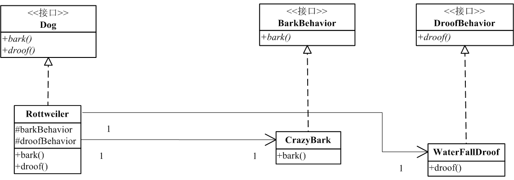

# 策略模式

策略模式是极常使用的模式之一。

### 是什么？

策略模式定义了算法族，分别封装，让他们可以相互替换。 此模式让算法的变化独立于使用算法的对象。

### 作用及应用场景

举个简单的例子什么时候需要策略模式。现在，假如我们要写一个关于狗的游戏或者什么的。
那么，我们定义一只狗一般会叫，会流口水：
[include:7-](../src/main/java/com/tea/strategy/Dog.java)
那么我最爱的洛威拿狗(rottweiler)就出来了:
[include:7-](../src/main/java/com/tea/strategy/RottweilerWithoutStrategy.java)
这狗会叫会流口水。

可是，问题是，可能有些种类的狗不会叫，不会流口水。又或者，我想针对不同的狗种，有不同的叫声，不同的。。。,不同的。。。（省略。。）
难道是通过把不同的叫声写在不同的抽象类了，然后继承？又或者每种狗都实现自己的代码（叫声）？岂不是各种重复又缺乏灵活性，显然都不合理。

**一般设计上都会尽量少用继承，多用组合，把变化都封装独立起来。**
策略模式登场。

上图就是Strategy模式的uml图，我把叫声Bark独立为了BarkBehavior，这样当不同Dog需要不同类型的叫声随便set进去就是了。核心实现类Rottweiler代码如下：

[import:7-](../src/main/java/com/tea/strategy/Rottweiler.java)

其实更细致一点，可以把Dog接口改为抽象类或增加一个抽象类，把BarkBehavior和DroofBehavior作为属性抽象到抽象类中。这里就不再作拓展。

应用场景：

everywhere.具体点来说，当一个类存在一系列可相互替换的算法时，使用策略模式可消除该类与同类算法族之间的耦合，并使算法达到重用。

### References
（无）。