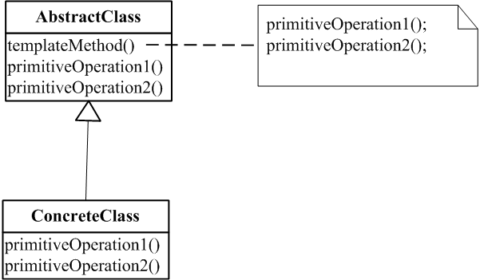

# 模板方法模式

### 是什么？

模板方法模式在一个方法中定义一个算法的骨架，而将一些步骤延迟到子类中。

### 结构组成及作用

下图是模板方法模式的UML类图：

模板方法模式还存在一种形式，即比如primitiveOperation1还可以是：（出自[[1]](#references)的描述。）
> 一个钩子操作（hook operations），它提供了缺省的行为，子类可以在必要时进行扩展。一个
> 钩子操作在缺省操作通常是一个空操作(空方法)。
>
> 很重要的一点是模板方法应该指明哪些操作是钩子操作（可以被重定义）以及哪些是抽
> 象操作（必须被重定义）。要有效地重用一个抽象类，子类编写者必须明确了解哪些操作是设
> 计为有待重定义的。

事实上，模板方法模式实现形式不是千遍一律，例如：Java中的Arrays.sort(Object[] o)方法和该方法中调用的compareTo就是一个模板方法模式的实现，但是他们并没有使用继承。

作用：模板方法是一种代码复用的基本技术。模板方法导致一种反向的控制结构，使得结果是一个父类去调用子类的操作，而不是子类调用父类。

### 示例实现

[完整代码么么哒](https://github.com/teaho2015/design-patterns-learning/tree/master/src/main/java/com/tea/templateMethod/)。

模板方法的实现其实在jdk中随处可见，比如，<code>java.io.InputStream</code>的<code>read(byte b[], int off, int len)</code>方法；<code>java.text.DateFormat</code>中的<code>parse(String source)</code>方法等等。

### 效果及应用场景

1. 当希望先实现算法的不变部分，然后再将可变的操作留给子类实现。

2. 当希望提取一些公共的操作到父类以避免重复时。

可使用模板方法模式。

### references
[2]Erich Gamma,Richard Helm,Ralph Johnson,John Vlissides.设计模式:可复用面向对象软件的基础[M].中国:机械工业出版社，2000