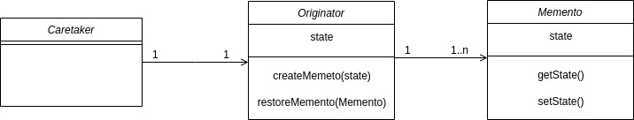

# 备忘录模式

### 是什么？

备忘录模式又称标记模式。在不破坏封装性的前提下，捕获一个对象的内部状态，并在该对象之外保存这个状态。这样以后就可以将该对象恢复到原先保存的状态，
简而言之就是保存一个对象的某个状态，以便在适当的时候恢复对象。

### 结构组成及作用

备忘录模式包含三种角色类：
1. Memento 存储要被恢复的对象状态。
2. Originator 创建并使用Memento对象。
3. CareTaker 负责从Memento对象恢复状态。

UML：

作用：

在不破坏封装的情况下，提供一种可以恢复状态的机制。

### 实现

主方法：主要演示了创建3种状态，恢复到其中一种状态。
[include:7-](../src/main/java/com/tea/memento/TestMain.java)

~~~输出
//输出

NOW STATE IS state1
NOW STATE IS state2
NOW STATE IS state3
restore state to : state2

~~~

Caretaker：

[include:6-](../src/main/java/com/tea/memento/Caretaker.java)

Originator：

[include:4-](../src/main/java/com/tea/memento/Originator.java)

Memento：

[include:3-](../src/main/java/com/tea/memento/Memento.java)

### 效果及应用场景

基于状态可以做到这样的神奇操作：
1. 可以做到会回滚对象状态。
2. 重放状态。

### References

[1]https://en.wikipedia.org/wiki/Memento_pattern  
[2]Erich Gamma,Richard Helm,Ralph Johnson,John Vlissides.设计模式:可复用面向对象软件的基础[M].中国:机械工业出版社，2000  
[3]https://www.runoob.com/design-pattern/memento-pattern.html